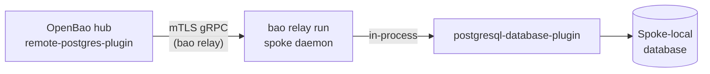

# OpenBao vs. Vault

OpenBao forked from the last MPL-2.0 release of HashiCorp Vault. Since then,
upstream Vault has moved to the Business Source License and, following
HashiCorp's acquisition, is now an IBM product; OpenBao stays OSI-licensed
(MPL-2.0) under the Linux Foundation. This page tracks what that split
means in practice, feature by feature, across three things:

- **Vault Community Edition** — the free, self-managed edition of Vault.
- **Vault Enterprise** — the commercially licensed edition, self-managed or
  via HCP Vault Dedicated.
- **OpenBao**, as shipped by this fork — upstream OpenBao plus the
  restorations and new plugins this fork has added on top of it.

Where this fork's own additions matter to a row, they're called out
separately from upstream OpenBao's baseline.

## In short

- Vault Community and Vault Enterprise are the same code behind a license
  gate. Enterprise is the only one of the three with cross-cluster
  **replication** and **Sentinel** policy-as-code; nobody has shipped an
  open equivalent of either.
- OpenBao has closed several of those Enterprise gaps in the open:
  **namespaces**, **control groups**, **performance standby nodes**,
  **seal wrap**, **KMIP**, **Transform**, and **Key Management** secrets
  engines are all upstream now, for free.
- This fork's signature addition is
  [`remote-db-plugin`](#remote-db-plugin-hub-and-spoke-database-credentials),
  a hub-and-spoke proxy for database credentials over mTLS gRPC, which
  exists in none of the other three. It also restores database plugins
  and storage backends upstream OpenBao dropped at the fork point, and
  adds engines (vector databases, Kafka, graph, search) Vault itself has
  never shipped.
- In exchange, OpenBao (upstream and this fork alike) ships without some
  Vault Community baseline items: built-in cloud auth/secrets
  (AWS/Azure/GCP), GitHub/Okta auth, and a few long-tail database
  connectors (Couchbase, Redshift, Snowflake, Mongo Atlas). These were
  deliberately cut at the fork point, not forgotten.

Legend used in the tables below: **Yes** (shipped), **Partial** (shipped
but limited or on a deprecation path), **Pending** (an open, unmerged pull
request in this fork), **No** (not available).

## Licensing & governance

| | Vault Community | Vault Enterprise | OpenBao |
| --- | --- | --- | --- |
| License | BUSL-1.1 | BUSL-1.1 (commercial) | MPL-2.0 (OSI-approved) |
| Governance | IBM | IBM | Linux Foundation |
| Support | Community only | Commercial SLA | Community + self-hosted |
| Managed service | None | HCP Vault Dedicated | None (self-hosted) |

## Multi-tenancy & policy governance

| Feature | Vault Community | Vault Enterprise | OpenBao |
| --- | --- | --- | --- |
| Namespaces (isolated tenants in one cluster) | No | Yes | Yes |
| Control groups (second-party approval on a path) | No | Yes | Yes |
| Sentinel (EGP / RGP policy-as-code) | No | Yes | No — proprietary, not reimplemented |
| ACL policies (path-based allow/deny) | Yes | Yes | Yes |
| CEL policy expressions (PKI issuance, JWT auth validation) | No | No | Yes — neither Vault edition has this |

## Replication & high availability

| Feature | Vault Community | Vault Enterprise | OpenBao |
| --- | --- | --- | --- |
| Integrated Storage (Raft) HA | Yes | Yes | Yes |
| Raft autopilot (dead-server cleanup, stabilization) | Yes | Yes | Yes |
| Performance standby nodes (local reads on non-active nodes) | No | Yes | Yes |
| Performance replication (cross-cluster) | No | Yes | No |
| Disaster recovery replication | No | Yes | No |

## Seal, HSM & key management

| Feature | Vault Community | Vault Enterprise | OpenBao |
| --- | --- | --- | --- |
| Cloud KMS auto-unseal (AWS, Azure, GCP, Alicloud, OCI) | Yes | Yes | Partial — deprecated, moving to a plugin in v2.7 |
| HSM / PKCS#11 auto-unseal | No | Yes | Partial — same v2.7 plugin move |
| Seal wrap (HSM-backed encryption of sensitive values at rest) | No | Yes | Yes |
| KMIP secrets engine | No | Yes | Yes |
| Transform secrets engine (FPE, tokenization, masking) | No | Yes | Yes |
| Key Management secrets engine | No | Yes | Yes |
| FIPS 140-validated builds | No | Yes | No |

## Auth methods & MFA

OpenBao's cuts show up here more than anywhere else: cloud-provider auth
was dropped at the fork point.

| Feature | Vault Community | Vault Enterprise | OpenBao |
| --- | --- | --- | --- |
| Core auth (AppRole, TLS cert, JWT/OIDC, Kubernetes, userpass) | Yes | Yes | Yes |
| Cloud auth (AWS, Azure, GCP, Alicloud, OCI) | Yes | Yes | No — removed at fork |
| GitHub / Okta auth | Yes | Yes | No — removed at fork |
| LDAP / Kerberos / RADIUS | Yes | Yes | Partial — deprecated, removal targeted v2.7 |
| Login MFA (Duo, Okta, PingID, TOTP) | Yes | Yes | Yes |
| Step-up MFA & SAML | No | Yes | No |

## Secrets engines

The non-database engines. Vault's cloud-provider and third-party-platform
engines follow the same fate as cloud auth.

| Feature | Vault Community | Vault Enterprise | OpenBao |
| --- | --- | --- | --- |
| KV, PKI, SSH, TOTP, Transit, Kubernetes, LDAP | Yes | Yes | Yes |
| RabbitMQ | Yes (own secrets engine) | Yes | Yes — migrated into the database plugin framework |
| Cloud secrets (AWS, Azure, GCP, GCP KMS, Alicloud) | Yes | Yes | No — removed at fork |
| Active Directory, Consul, Nomad, Terraform Cloud, Mongo Atlas secrets | Yes | Yes | No — removed at fork |
| Secrets sync & import (push/pull with external secret managers) | No | Yes | No |

## Database secrets plugins

Database plugin availability has never been a Community/Enterprise split
in Vault — both editions ship the same list. The real divide is Vault vs.
this fork, and it runs in both directions: Vault still has a few
long-tail connectors this fork hasn't restored, while this fork ships
several engines (vector databases, Kafka, graph, search) Vault has never
shipped at all.

| Plugin | Vault (CE & EE) | OpenBao (this fork) |
| --- | --- | --- |
| MySQL / MariaDB (+ Aurora, RDS, legacy) | Built-in | Built-in |
| PostgreSQL | Built-in | Built-in, + inline TLS certs |
| Cassandra | Built-in | Built-in |
| InfluxDB | Built-in | Built-in |
| Redis / Valkey | Built-in | Built-in, on `valkey-go` rather than `radix` |
| MongoDB | Built-in | Built-in — restored |
| Microsoft SQL Server | Built-in | Built-in — restored |
| Elasticsearch / OpenSearch | Built-in | Built-in — restored |
| SAP HANA | Built-in | Built-in — restored |
| Oracle | External plugin only | Built-in |
| MongoDB Atlas | Built-in | No |
| Couchbase | Built-in | No |
| Amazon Redshift | Built-in | No |
| Snowflake | Built-in | No |
| IBM Db2 | No | Pending — open PR |
| Neo4j (graph) | No | New to this ecosystem |
| Apache Solr (search) | No | New to this ecosystem |
| Apache Druid (OLAP) | No | New to this ecosystem |
| Apache Ignite (in-memory grid) | No | New to this ecosystem |
| Apache Kafka (SCRAM users) | No | New to this ecosystem |
| Milvus (vector) | No | New to this ecosystem |
| Qdrant (vector, static-only) | No | New to this ecosystem |
| Weaviate (vector, static-only) | No | New to this ecosystem |
| etcd | No | New to this ecosystem |
| Remote proxy variant of every plugin above, via hub-and-spoke | No | 21 `remote-*` plugins |

## Storage backends

Upstream OpenBao's baseline is deliberately thin: Integrated Storage and
PostgreSQL. This fork is mid-flight restoring the rest as individually
reviewed pull requests rather than one bulk re-add, so most rows below are
marked **Pending** rather than shipped.

| Backend | Vault (CE & EE) | OpenBao upstream | This fork |
| --- | --- | --- | --- |
| Integrated Storage (Raft) | Yes | Yes | Yes |
| PostgreSQL | Yes | Yes | Yes |
| MySQL, Cassandra, etcd, ZooKeeper, CouchDB, MSSQL | Yes | No | Pending — open PR |
| DynamoDB, S3, CockroachDB, Azure, GCS, Spanner | Yes | No | Pending — open PR |
| FoundationDB, Aerospike, Swift, OCI, Alicloud OSS | Yes | No | Pending — open PR |
| Consul, Manta | Yes | No | No — Consul skipped deliberately, Manta not attempted |

## What only this fork has

Beyond restoring what upstream OpenBao dropped, this fork adds one
architectural piece that doesn't exist anywhere else in this comparison.

### `remote-db-plugin` — hub-and-spoke database credentials

A hub OpenBao instance brokers credential operations over mutual-TLS gRPC
to one or more `bao relay run` spoke daemons, which run the actual
built-in database plugin in-process against a database the hub can't
reach directly. The hub sees an ordinary `remote-*-plugin`; the spoke does
the real work.

- Trust bootstrap mirrors `kubeadm`: a one-time token, detached
  JWS-HS256 over the cluster-info bundle, and an SPKI-hash pin on the
  spoke CA.
- Every one of the 24 built-in database plugins gets a `remote-*`
  counterpart automatically — 21 shipped today, Db2's tracking its own
  plugin pull request.
- Spoke certs auto-renew; the hub evicts idle cached plugin instances
  after 24 hours.

See [`internal/builtin/database/remote-db-plugin/DESIGN.md`](https://github.com/sigilr/openbao/blob/main/internal/builtin/database/remote-db-plugin/DESIGN.md)
in the source tree for the full architecture.

### By the numbers

- **14** database plugins restored or added this cycle: MongoDB, MSSQL,
  Oracle, Elasticsearch, HANA, Neo4j, Solr, Druid, Milvus, Ignite, Kafka,
  Qdrant, Weaviate, and etcd — Db2 is in review.
- **17** storage backends in review to restore upstream OpenBao's cuts.
- **21** `remote-*-plugin` proxies, one per built-in database plugin.
- **3** engine families (graph, vector, streaming) Vault has never
  shipped at all.

## Sources

- HashiCorp, [Vault available editions](https://developer.hashicorp.com/vault/tutorials/get-started/available-editions)
- We The Flywheel, [OpenBao vs. HashiCorp Vault](https://wetheflywheel.com/en/comparisons/openbao-vs-hashicorp-vault/)
- This fork's own source: `internal/helper/builtinplugins/registry.go`,
  `internal/physical/`, and `REMOVED_VAULT_FEATURES.md`, checked directly
  against the running tree rather than taken on description alone.
- OpenBao project docs: [Namespaces](concepts/namespaces/index.mdx),
  [CEL in OpenBao](concepts/cel.mdx),
  [Control groups RFC](/community/rfcs/control-groups),
  [KMIP seal configuration](configuration/seal/kmip.mdx).

"Shipped" means merged to this fork's `main` branch; "pending" means
written and under review but not yet merged. Treat the latter as a
credible near-term roadmap, not a shipped claim.
